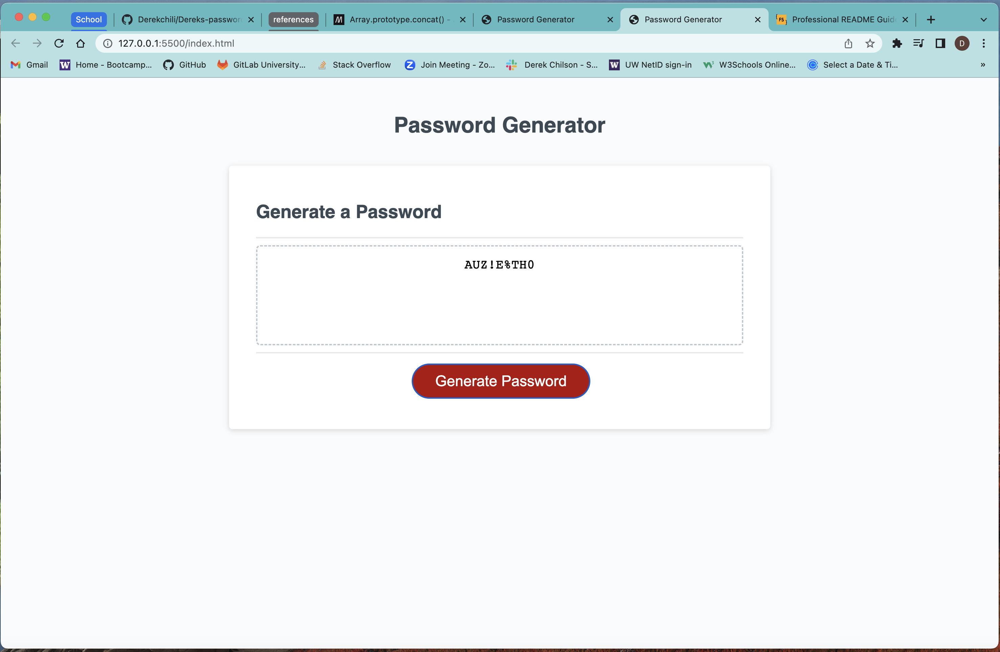

# Dereks-password
## Description
I was motivated to do this project to keep learning more JavaScript. We had to modify the Javascript code to make it link up with the HTML and CSS, had to add js functions and variables to get the password generator working properly. Inside a study group last night we colaberated to get the ball rolling in hte right direction. Once I firgured out how to concatenate the input to a variable got it to work. Had a TA this morning to help me firgure out the best way to "is selected no on all" to just give a pswd.
    I learned a little bit more about the way the functions, global arrays, and concatenate works.

## Credits
Had a tutor Andres help me this morning to kind of make all things work together, I had the foundation working just needed some fine tuning.

## Usage

The page is a password generator it takes in user input asking if you want numbers, symbols, uppercase, lowercase and characters between 8-128 long. Then after it asks all the questions it gives a password at the end.

https://derekchili.github.io/Dereks-password/

Had some frustrating moments doing this project.
